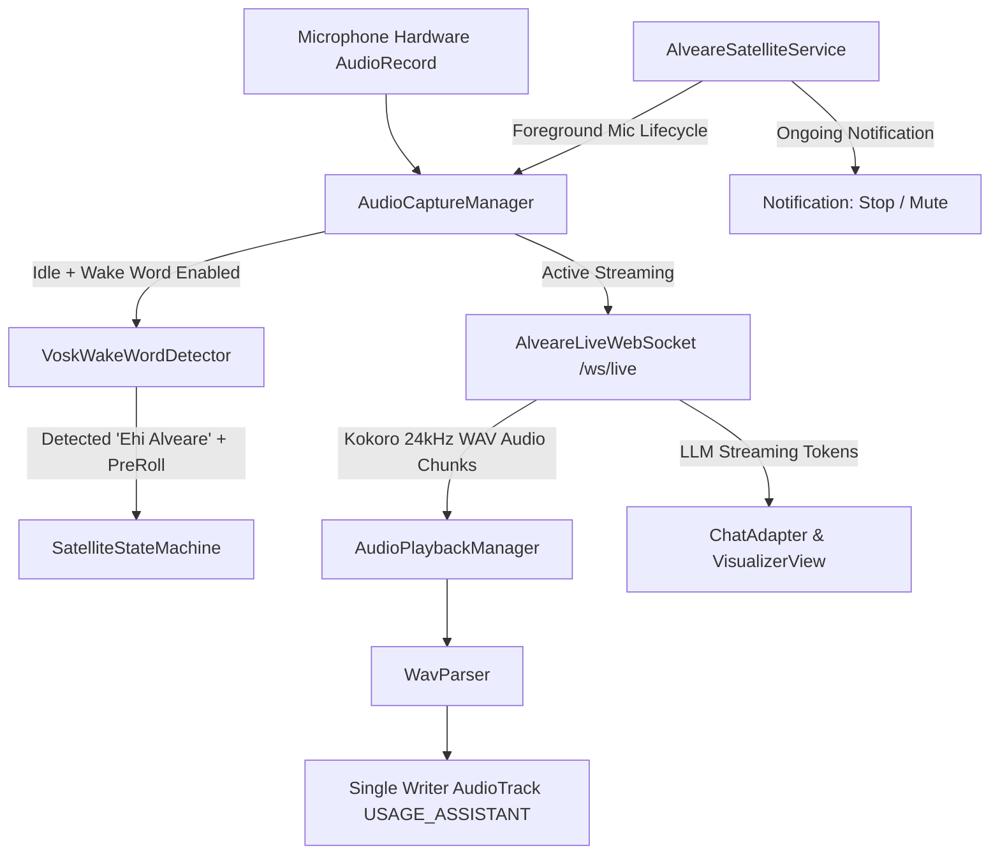

# Alveare Android Voice Satellite (v0.1.0-alpha.1)

Native, lightweight Android companion satellite for [**Alveare 3.0**](https://github.com/daino-selvatico/alveare) smart home & voice intelligence.
Designed specifically to repurpose Android devices (compatible down to Android 7.0 Nougat / **minSdk 24**) as dedicated ambient smart speakers and voice interfaces.

> [!NOTE]
> **Alpha Status**: This project is currently in active pre-release development (**v0.1.0-alpha.1**). Features, UI, and protocol specs correspond to the Alveare 3.0 Live WebSocket protocol (`/ws/live`).

---

## Key Features (v0.1.0-alpha.1)

### 1. Distinct Operational Modes
- **🤖 Modalità Assistente (Turn-based)**:
  - One user utterance $\rightarrow$ LLM generation $\rightarrow$ Kokoro/Audio8 speech synthesis $\rightarrow$ return to idle waiting for activation.
  - Does **not** stream continuous audio to the server while idle, saving Wi-Fi bandwidth and server VAD cycles.
- **⚡ Modalità Live (Experimental Full-Duplex)**:
  - Continuous low-latency streaming to Alveare's `/ws/live` endpoint.
  - Server-side VAD, time-to-first-token (TTFT) metrics, and instant barge-in interruption detection.
- **👆 Tap-to-Talk Fallback**:
  - Always available in both modes as a physical tap-to-talk button (tap to speak, tap again to finish utterance early or interrupt).

### 2. REAL Offline Lexical Wake Phrase Recognition ("Ehi Alveare")
- **No amplitude/energy-burst hacks**: The previous energy-burst detector has been completely removed.
- **Real Kaldi/Vosk Speech Graph**: Employs the compact Italian Kaldi model (`vosk-model-small-it-0.22`) with an explicitly restricted grammar:
  ```json
  ["ehi alveare", "[unk]"]
  ```
- **Official Model Distribution**: Downloaded directly from Alpha Cephei (~43 MB compressed, ~49 MB extracted) via a user-initiated setup dialog in Settings with progress reporting, cancellation, and validation.
- **Single `AudioRecord` Owner**: A single audio capture thread owns the physical microphone. It feeds raw 16kHz PCM to the Vosk recognizer while idle, and routes directly to the WebSocket after activation.
- **Pre-Roll Protection**: A circular buffer retains the preceding ~800ms of audio, ensuring the user's speech immediately following or during the wake phrase is never trimmed.
- **Self-Trigger Prevention**: Audio capture automatically mutes the wake recognizer while the assistant speaks.

### 3. Stable Lifecycle & Audio Engine
- **Foreground Microphone Service (`AlveareSatelliteService`)**:
  - Compliant with Android 14 (`targetSdk 34`) foreground service microphone rules.
  - Persistent ongoing notification with **Privacy Muto** and **Stop / Disconnetti** action buttons.
  - Never started implicitly in the background without explicit user interaction.
- **Real Privacy Mute**: Shuts down, stops, and releases the physical `AudioRecord` microphone hardware and audio effects. Recording resumes only on explicit user unmute when the service is connected and active.
- **Bounded Reconnect Backoff**: Exponential backoff (1s, 2s, 4s, 8s, 16s, max 30s) on disconnect, cancelled immediately on manual stop.
- **Robust WAV RIFF Chunk Parser (`WavParser`)**: Replaces hardcoded 44-byte stripping with a true RIFF chunk walker supporting extra metadata chunks (`JUNK`, `LIST`), variable sample rates (16000, 24000, 44100 Hz), and Kokoro TTS streams.
- **Additive Protocol Handshake**: Adheres to `live_connected.input_sample_rate` (16000) and `live_connected.output_sample_rate` (24000/44100).
- **TTS Mode Switching**: Supports `config.settings.tts_mode = 'server' | 'client'`. In client mode, the server suppresses audio synthesis and the client speaks via Android Native TTS.
- **Speaker Feedback & Echo Suppression**: Pauses mic capture during assistant speech playback in loudspeaker mode, preventing self-interruption loops.
- **Natural Utterance Margins**: 8-second speech onset grace period post-chime and 1.4-second natural silence detection for relaxed, unhurried voice turns.
- **Robust LAN Discovery & URL Normalization**: Automatically trims accidental whitespace and resolves `.local` mDNS hostnames to the actual LAN IP.
- **UI Performance & History**: Throttles UI streaming token updates, preserves conversation history up to 50 turns, and uses conditional auto-scrolling to allow reading past turns without disruption.

---

## Architecture Overview



---

## Installation & Build Instructions

### Prerequisites
- JDK 17 or JDK 21
- Android SDK (API 34 compileSdk, API 24 minSdk) configured via `local.properties` (e.g. `sdk.dir=/home/daino/android-sdk`)

### Commands

1. **Run Unit Tests**:
   ```bash
   ./gradlew testDebugUnitTest
   ```
2. **Build Debug APK**:
   ```bash
   ./gradlew assembleDebug
   ```
3. **Run Android Lint**:
   ```bash
   ./gradlew lintDebug
   ```
4. **Install onto Device via ADB**:
   ```bash
   adb install app/build/outputs/apk/debug/app-debug.apk
   ```

---

## Older Hardware Considerations

1. **Resource Profile (Unverified Pending Physical Device Testing)**:
   - Memory footprint and CPU load have **not** been benchmarked on physical hardware or emulators in this test environment.
   - Resource requirements will vary significantly across ARM32 vs ARM64 SoC designs, OEM background throttling, and available RAM.
2. **Operational Guidelines**:
   - For dedicated smart speaker duty, keeping the phone connected to a 5V/1A or 5V/2A USB charger on a stand is recommended.
   - Enabling **Modalità Smart Display** in Settings keeps the screen dimly lit with the ambient visualizer orb, which prevents OEM power managers from killing background tasks.

---

## Limitations & Honest Status Report

- **Physical Device & Voice QA Pending**: Unit test suites pass hermetically in the host environment, but end-to-end voice quality, OEM hardware Acoustic Echo Cancellation (AEC), and audio glitch resilience remain to be verified on actual hardware test benches.
- **Unverified Hotword Accuracy & Power Consumption**: Lexical hotword trigger rates, false rejects/accepts under ambient room noise, and battery drain are unverified.
- **Screen-Off Mic on Aggressive Battery Saver OS**: Certain aggressive OEM ROMs (e.g. MIUI, EMUI) terminate foreground microphone services when the screen is turned off for extended periods regardless of wake locks. On such devices, keeping the screen active via Smart Display mode is recommended.
